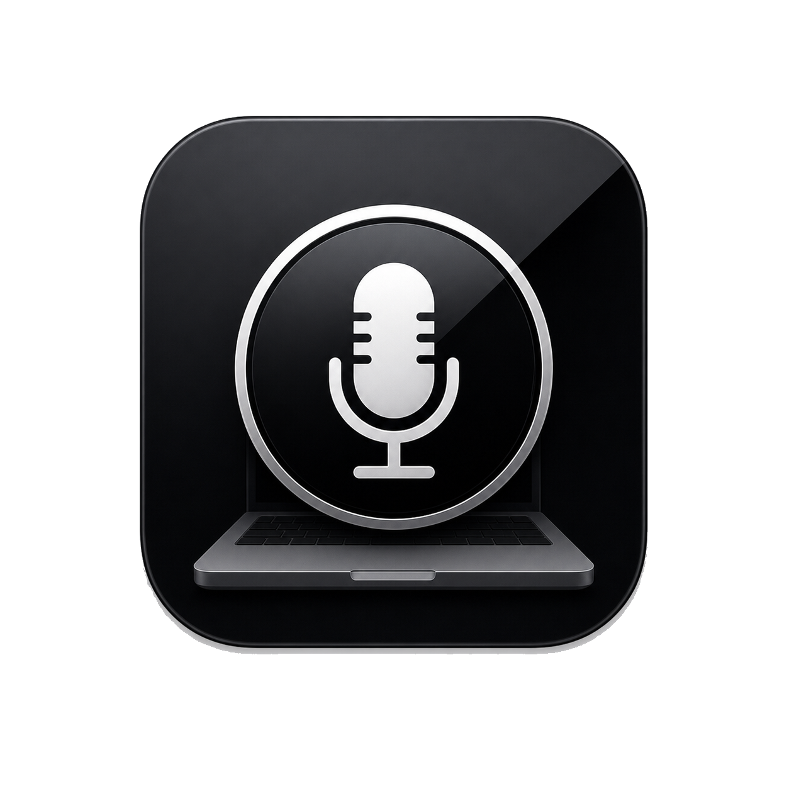
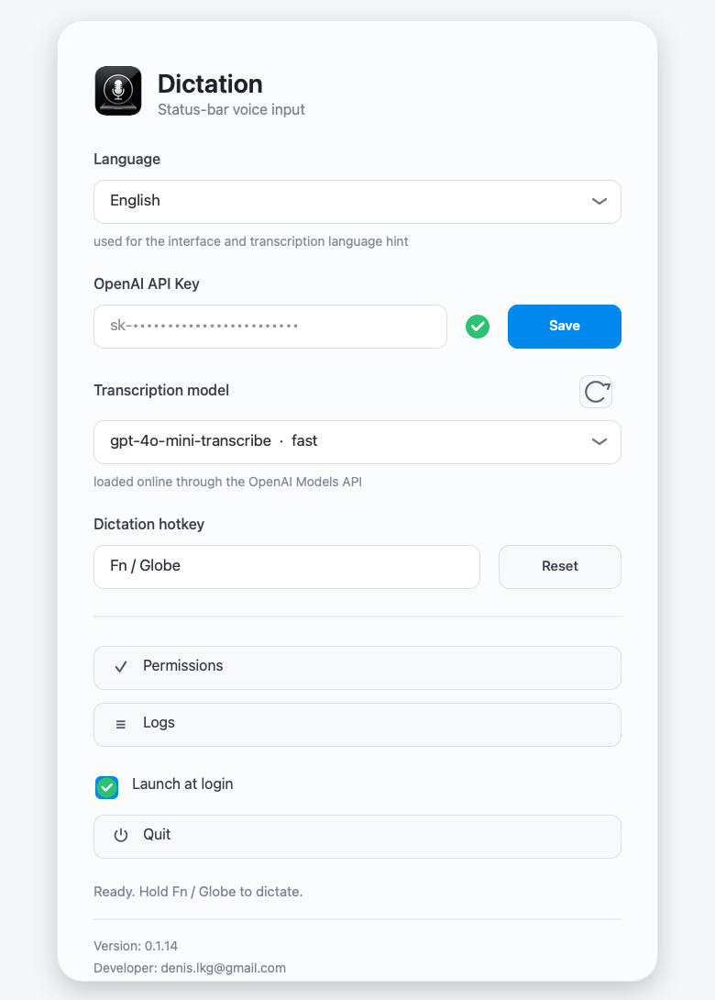
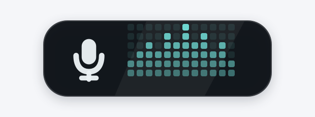

<div align="center">
  
  <h1>Dictation</h1>
  <p><strong>Native macOS push-to-talk dictation powered by OpenAI.</strong></p>
  <p>
    
    
    
  </p>
  <p>
    <a href="#english">English</a>
    ·
    <a href="#russian">Русский</a>
  </p>
</div>

---

<a id="english"></a>

## English

Dictation is a small macOS status-bar app for fast voice input. Hold a hotkey, speak, release it, and the transcribed text is pasted into the app you were using.

It is designed for people who want a lightweight local utility rather than a full writing environment.

### Screenshots

<p align="center">
  
</p>

<p align="center">
  
</p>

### Highlights

| Area | What it does |
| --- | --- |
| Push-to-talk | Records only while the selected hotkey is held. |
| OpenAI transcription | Sends audio to OpenAI after recording and pastes the result. |
| Model picker | Loads transcription-capable models from the OpenAI Models API. |
| Menu-bar UI | Runs near the clock with no Dock icon. |
| Live overlay | Shows a bottom-right microphone badge with a real voice-reactive equalizer. |
| Secure token storage | Stores the OpenAI API key in macOS Keychain. |
| Installer | Provides an idempotent package installer that replaces old app copies. |

### Download

Current builds are included in the repository:

- [Dictation.dmg](dist/Dictation.dmg)
- [Dictation.pkg](dist/Dictation.pkg)

For most users, download the DMG, open it, and run `Install Dictation.pkg`.

The current build is ad-hoc signed and not notarized with an Apple Developer ID. macOS may show a first-launch warning. For broad public distribution, build with Developer ID signing and notarization.

### Requirements

- macOS 14 or newer.
- OpenAI API key with access to transcription-capable models.
- Microphone permission.
- Accessibility permission so Dictation can paste text into the active app.
- Input Monitoring permission may be required by macOS for some global hotkey configurations.

OpenAI API references:

- [Speech to text](https://platform.openai.com/docs/guides/speech-to-text)
- [Audio transcriptions API](https://platform.openai.com/docs/api-reference/audio/createTranscription)
- [Models API](https://platform.openai.com/docs/api-reference/models/list)

### Install

1. Download [Dictation.dmg](dist/Dictation.dmg).
2. Open the DMG.
3. Run `Install Dictation.pkg`.
4. Open Dictation from the status bar near the clock.
5. Paste your OpenAI API key and press `Save`.
6. Grant Microphone and Accessibility permissions when macOS asks.
7. Hold the configured hotkey, speak, and release to paste the transcript.

If `Fn / Globe` does not start recording, macOS keyboard settings may be using that key for system features. Open the Dictation menu and assign another hotkey.

### Privacy

Dictation is local-first, but it is not offline.

- Audio is recorded locally only while the hotkey is held.
- Audio is sent to OpenAI for transcription after the hotkey is released.
- Successful and failed recordings are deleted after the current processing attempt.
- Transcribed text is pasted through the system clipboard, then the previous clipboard contents are restored.
- Transcribed text is not written to logs.
- The OpenAI API key is stored in macOS Keychain.
- Logs keep only the last 10 entries and are intended for debugging status and errors.

Read the full notes in [PRIVACY.md](PRIVACY.md).

### Build From Source

Install Xcode Command Line Tools, then run:

```sh
swift run DictationTestsRunner
Scripts/build-dmg.sh
```

The build output is written to `build/`:

- `build/Dictation.pkg`
- `build/Dictation.dmg`

The package build uses temporary staging directories so build-only app bundles are not indexed by Launchpad or Spotlight.

### Test

```sh
swift run DictationTestsRunner
```

The test runner covers hotkey capture, OpenAI model filtering, transcript merging, chunk planning, equalizer behavior, queue cleanup, log rotation, single-instance policy, and app metadata.

### Project Status

Dictation is ready for local use and public source sharing. It is not notarized, sandboxed, or App Store distributed.

Recommended next steps for wider distribution:

- Developer ID signing.
- Apple notarization.
- GitHub Releases for versioned downloads.
- Optional Homebrew cask.

### Community

- [Contributing guide](CONTRIBUTING.md)
- [Security policy](SECURITY.md)
- [Changelog](CHANGELOG.md)
- [License](LICENSE)

---

<a id="russian"></a>

## Русский

Dictation - это маленькое macOS-приложение в панели статуса для быстрой диктовки. Удерживаете горячую клавишу, говорите, отпускаете клавишу, и распознанный текст вставляется в активное приложение.

Приложение сделано как легкая локальная утилита, а не как отдельная среда для письма.

### Скриншоты

<p align="center">
  
</p>

<p align="center">
  
</p>

### Возможности

| Раздел | Что делает |
| --- | --- |
| Push-to-talk | Записывает звук только пока удерживается выбранная горячая клавиша. |
| Транскрибация OpenAI | Отправляет аудио в OpenAI после записи и вставляет результат. |
| Выбор модели | Загружает модели для транскрибации через OpenAI Models API. |
| UI в панели статуса | Работает около часов, без иконки в Dock. |
| Живой оверлей | Показывает бейдж справа снизу: микрофон и эквалайзер, реагирующий на голос. |
| Хранение токена | Сохраняет OpenAI API key в macOS Keychain. |
| Установщик | Устанавливает одну копию приложения и заменяет старые дубликаты. |

### Скачать

Актуальные сборки лежат прямо в репозитории:

- [Dictation.dmg](dist/Dictation.dmg)
- [Dictation.pkg](dist/Dictation.pkg)

Обычно достаточно скачать DMG, открыть его и запустить `Install Dictation.pkg`.

Текущая сборка подписана ad-hoc и не notarized через Apple Developer ID. macOS может показать предупреждение при первом запуске. Для широкой публичной раздачи лучше собрать приложение с Developer ID signing и Apple notarization.

### Требования

- macOS 14 или новее.
- OpenAI API key с доступом к моделям транскрибации.
- Разрешение на микрофон.
- Разрешение Accessibility, чтобы приложение могло вставлять текст в активное окно.
- Input Monitoring может понадобиться для глобальной горячей клавиши на некоторых настройках macOS.

Документация OpenAI:

- [Speech to text](https://platform.openai.com/docs/guides/speech-to-text)
- [Audio transcriptions API](https://platform.openai.com/docs/api-reference/audio/createTranscription)
- [Models API](https://platform.openai.com/docs/api-reference/models/list)

### Установка

1. Скачайте [Dictation.dmg](dist/Dictation.dmg).
2. Откройте DMG.
3. Запустите `Install Dictation.pkg`.
4. Откройте Dictation из панели статуса около часов.
5. Вставьте OpenAI API key и нажмите `Save`.
6. Разрешите Microphone и Accessibility, когда macOS попросит.
7. Удерживайте горячую клавишу, говорите и отпустите клавишу, чтобы вставить текст.

Если `Fn / Globe` не запускает запись, возможно macOS использует эту клавишу для системных функций. Откройте меню Dictation и назначьте другую горячую клавишу.

### Приватность

Dictation работает локально, но не является офлайн-приложением.

- Аудио записывается локально только во время удержания горячей клавиши.
- После отпускания клавиши аудио отправляется в OpenAI для транскрибации.
- Успешные и неуспешные записи удаляются после текущей попытки обработки.
- Распознанный текст временно помещается в системный буфер обмена, затем прежний буфер восстанавливается.
- Распознанный текст не пишется в логи.
- OpenAI API key хранится в macOS Keychain.
- Логи хранят только последние 10 записей и нужны для отладки статусов и ошибок.

Полное описание есть в [PRIVACY.md](PRIVACY.md).

### Сборка из исходников

Установите Xcode Command Line Tools, затем выполните:

```sh
swift run DictationTestsRunner
Scripts/build-dmg.sh
```

Результат сборки появится в `build/`:

- `build/Dictation.pkg`
- `build/Dictation.dmg`

Сборка пакета использует временные staging-каталоги, чтобы технические `.app`-копии не попадали в Launchpad или Spotlight.

### Тесты

```sh
swift run DictationTestsRunner
```

Тесты проверяют горячие клавиши, фильтрацию моделей OpenAI, объединение текста из чанков, планирование чанков, поведение эквалайзера, очистку очереди, ротацию логов, защиту от запуска второй копии и метаданные приложения.

### Статус проекта

Dictation готов для локального использования и публикации исходного кода. Приложение пока не notarized, не sandboxed и не распространяется через App Store.

Что стоит сделать для более широкой раздачи:

- Developer ID signing.
- Apple notarization.
- GitHub Releases для версионных загрузок.
- Опционально Homebrew cask.

### Сообщество

- [Как внести вклад](CONTRIBUTING.md)
- [Политика безопасности](SECURITY.md)
- [История изменений](CHANGELOG.md)
- [Лицензия](LICENSE)
